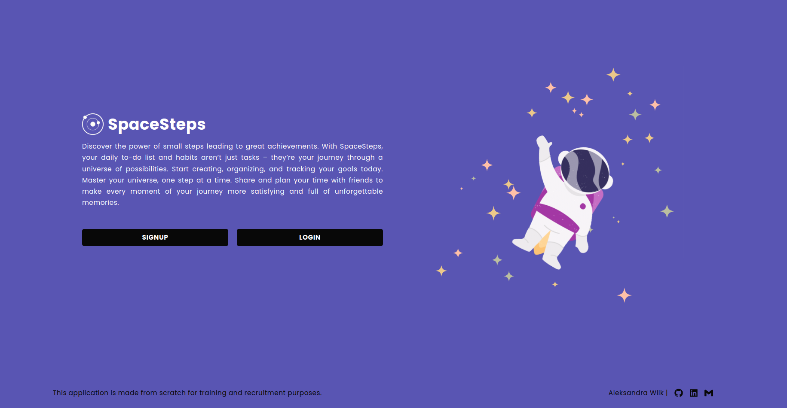
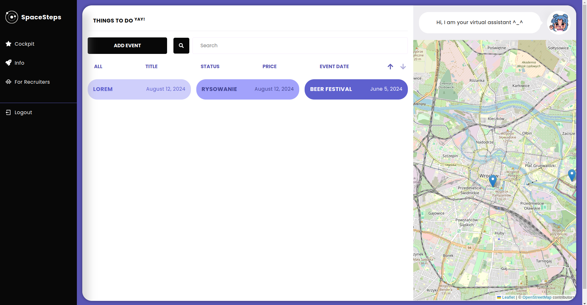
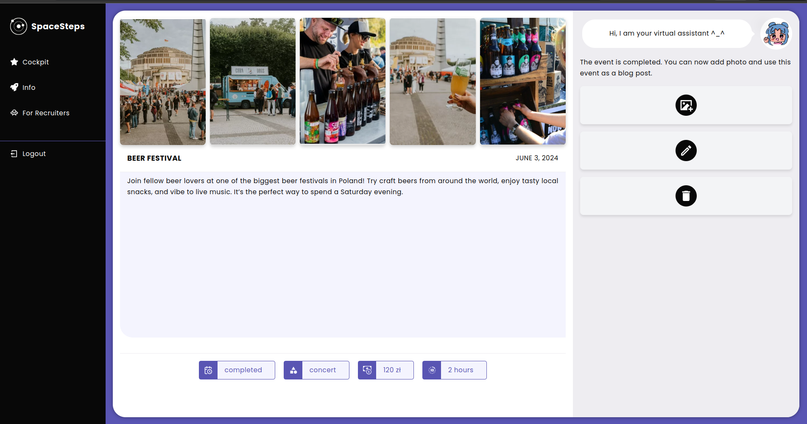

# 🍀 SpaceSteps overview v0.1.0 frontend

Welcome to the repository of my feature-rich application! Below is a detailed breakdown of the various functionalities and features offered by my platform:

## 🙋🏼‍♀️ Live demo:

[](https://www.youtube.com/watch?v=07dt1U2Rgts)

##### Home Page:

The home page welcomes users with a clean interface and offers two primary buttons: 'Login' and 'Signup'. Whether you're an existing user or a new one, getting started is straightforward and intuitive.

##### Signup Form:

Our signup form is designed with user experience in mind. It provides instant feedback if any field is filled incorrectly, and there's even an option to preview your password to ensure accuracy.

##### Main Dashboard (Cockpit):

Once logged in, users are directed to the Cockpit—a central hub where they can access all the features and tools of the application. The dashboard is designed for easy navigation and efficient management of your tasks.

##### Individual User Accounts:

Each user has a personalized account, ensuring a secure experience. Upon login, a unique token is generated and stored on the backend, enhancing security. The token is valid for 3 days, after which users are automatically logged out. The token is also removed from the backend when the user logs out manually.

##### Adding Events:

After logging into your account, you can easily add events. The 'Add Event' feature allows you to create and manage events effortlessly, keeping everything organized in one place.

##### Existing Account Alert:

If you attempt to create an account with an already registered email, the system will notify you that the account exists and prompt you to log in instead.

##### Event Privacy:

Events are linked to individual user accounts. When you switch to a different account, you won't see events created by other users, ensuring privacy and personalized event management.

##### Event Display on Cockpit:

All events created by the user are displayed on the Cockpit's main page. The events are shown as tiles on one side and on a map on the other, allowing users to see the event locations visually.

##### Form Error Handling:

The application’s forms are backed by robust error handling. For instance, if an incorrect address is entered, the system will notify you immediately, ensuring smooth and error-free interactions.

##### Automatic Settings and Map Integration:

When creating an event, the current date is automatically set, and the event status is marked as 'Planned'. Upon submission, a pin is instantly added to the map, reflecting the event's location.

##### Event Sorting and Filtering:

Users can sort events by title, status, price, and date. Additionally, filtering options are available to refine the event list. There are three event statuses: 'Planned' (light color), 'Ongoing' (blue), and 'Completed' (dark blue), making it easy to identify each event's status.



##### Event Editing and Deletion:

Expanding an event tile allows users to edit or delete the event. Editing redirects to the event’s page for modifications, while deleting prompts a confirmation to prevent accidental deletions.

##### Event to Blog Transformation:

When an event’s status is changed to 'Completed', it transforms into a blog where users can upload photos. These photos are stored in Dropbox, and the links are saved in a MySQL database on the backend.



##### Dropbox Integration:

The application features a Dropbox integration where all uploaded photos are securely stored. You can easily manage these photos by viewing them directly in Dropbox.

##### Photo Validation and Storage Limits:

Backend validation ensures that uploaded photos do not exceed 800x800 pixels, are no larger than 2MB, and are in JPG or PNG formats. The system also tracks the total number of photos stored in Dropbox to ensure users stay within the free storage limit.

##### Photo Deletion:

Photos can be easily deleted by clicking the 'Delete' button. This action removes the photo from both the database and Dropbox, streamlining media management.

##### Event Deletion Confirmation:

When attempting to delete an event, the system asks for confirmation to ensure that users do not accidentally remove important data.

##### Photo Limits and Responsiveness:

Each event can have up to 5 photos. The entire application is fully responsive, ensuring that photos and content are displayed beautifully on all devices.

##### Live Editing with Context:

All edits are made in real-time using context, allowing users to see changes instantly without needing to refresh or navigate away from the page.

##### Info and Recruiter Tabs:

The application includes an 'Info' tab that provides an overview of the app’s features. There’s also a dedicated tab for recruiters where users can upload and showcase their CVs.

##### Secure Access and Error Handling:

Users cannot access the application while logged out, ensuring data security. Additionally, if a logged-in user tries to access a non-existent page, a clear message informs them of the error.

## 📄 Documentation

**Design System:** [Download Design System PDF](./SpaceSteps_design-system.pdf)

## 🧘‍♀️ Resources

**Live demo:** IN PROGRESS \

**Github frontend:** [https://github.com/OllaWilk/to-do-zen-app-frontend](https://github.com/OllaWilk/to-do-zen-app-frontend)

**Github backend:** [https://github.com/OllaWilk/to-do-zen-app-backend](https://github.com/OllaWilk/to-do-zen-app-backend)

## 🐞 Tech Stack


## 🦋 Installation project

**Clone the project:**

```
git clone https://github.com/OllaWilk/to-do-zen-app-frontend.git
```

**Go to the project directory:**

```
cd to-do-zen-app-frontend
```

**Install dependencies:**

```
npm install
```

**Start the server:**

```
npm start
```
